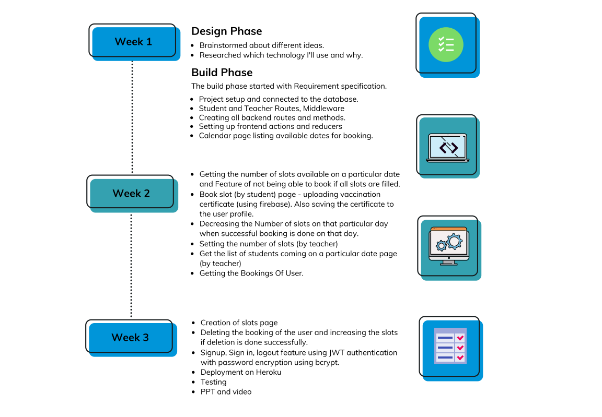
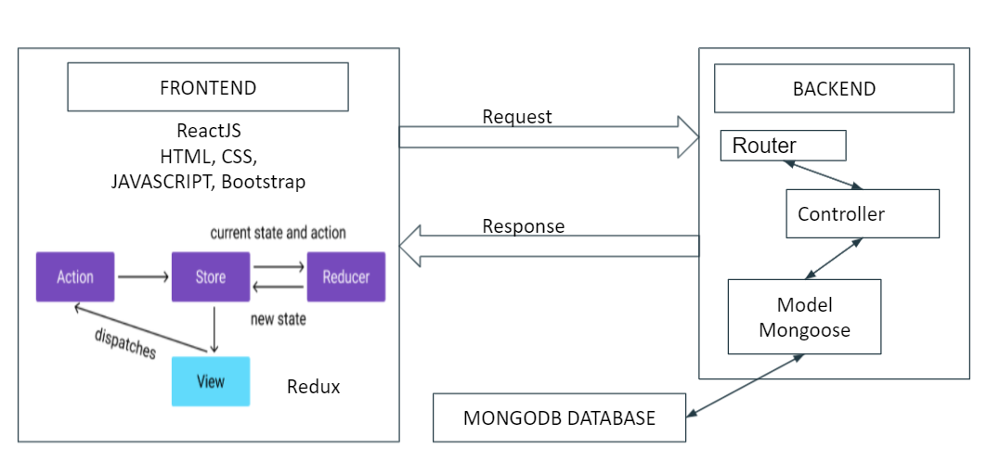
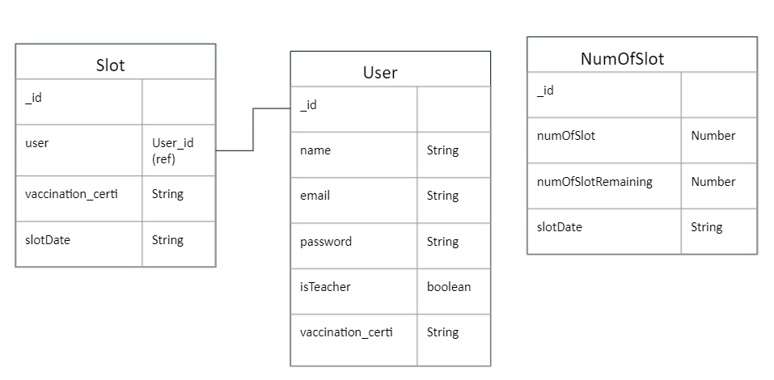

# HYBRID SCHEDULER

## Submission for Microsoft Engage November 2021 👩‍💻

Around 66% of the 18+ population of the country has received at least one dose of the Covid-19 vaccine. Schools, colleges, and institutions have started to finally open up. However, we also have to take essential measures to prevent the further spread of Covid-19 that’s where hybrid classes come into play.
Hybrid classes work in such a manner that half-strength would attend college/school and the same lecture would simultaneously be made available online for those attending lecture from their respective homes.

### PROBLEM
The problem that arise here is how to manage which student should come on which specific days, provided the number of students should not exceed the fixed number to maintain proper social distancing on each working day?

 

 

## Tech Stack

 

## Tools and Languages: 

 
 
 
 

 
 
 
 
 
 
 
 
 
 
 
 

 

## Instructions

1. `git clone https://github.com/aradhna7/Hybrid-Scheduler` 
2. `cd ./Hybrid-Scheduler`
3. Install node dependencies 
   - `npm install`
4. Replace firebase API keys with your configurations
5. `cd client`
6. Install node dependencies 
   - `npm install`
7. `cd ..`
8. Create a `.env` file 
   - Add relevant credentials
   - `cp .env.example .env` 
5. `npm run dev`
6. The app is now running at http://localhost:3000

 

## Features and Interfaces
1. Calendar page listing dates and number of slots available.

2. Book slot (by student) page - uploading vaccination certificate (using firebase) [Double booking on a particular day by user not allowed]

3. Decreasing the Number of slots on that particular day when successful booking is done on that day.

4. Delete booking by date (by student) and thus increasing the number of slot on that day.

5. Getting all Bookings Of a User. 

6. Set Number Of Slots on a particular date (by teacher)

7. Get the list of students coming on a particular date (by teacher)

8. Sign in, Signup feature using jwt authentication and encryption of password using bcrypt.

9. Separate dashboard for student and teacher.

 

## Project Timeline

 

## High level Design

 

## Database Schema

 

## Future Scope
 - Slot Booking available for different subject classes on a particular date
 - Sending a notification on email that a slot is booked on a date

 

## Need help?

Feel free to contact me on [LinkedIn](https://www.linkedin.com/in/aradhna7sharma/) 

